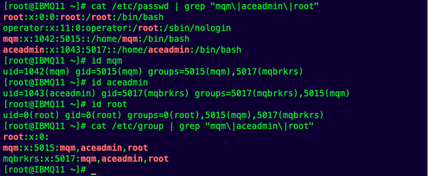

# IBM_MQ_Multi-Inst-ncia_com_App_Connect_Enterprise_Red-Hat-Enterprise-Linux_v9.6

## Introdução

##### A continuidade de negócios tem sido um requisito central para as empresas que dependem de integrações em tempo real e troca confiável de mensagens Neste documento apresentamos um passo a passo completo para a instalação de um ambiente ``IBM MQ Multi-Instância`` combinado com ``IBM App Connect Enterprise (ACE)`` utilizando três servidores ``Red Hat Enterprise Linux (RHEL)``

| Função | Hostname | Papel |
| ------ | -------- | ----- |
| Servidor de armazenamento compartilhado (NFS) | http://IBMQ11.com | Exporta o diretório /MQHA para logs e dados de fila compartilhados. |
| Instância prioritária do queue manage | http://IBMQ12.com | Ativa por padrão (primary). |
| Instância de standby do queue manager | http://IBMQ13.com | Assume automaticamente em caso de falha do primary. |

## Solução

#### Armazenamento compartilhado via NFS
O diretório ``/MQHA`` hospedado no ``IBMQ11`` é exportado para as duas máquinas de fila. Nele residem os logs e os dados do queue manager, permitindo que apenas uma instância (“priorizada”) tenha acesso exclusivo no momento, enquanto a outra permanece montada, pronta para assumir.

#### Queue Manager Multi-Instância

- Cada nó (**IBMQ12** e **IBMQ13**) possui a instalação completa do ``IBM MQ``.
- O comando ``crtmqm -ld /MQHA/logs -md /MQHA/qmgrs QM1`` cria a queue-manager *QM1* como multi-instancia.
- O serviço detecta alterações em nível de sistema de arquivos; se o host primary sofrer falha, o lock de acesso é liberado e o nó stand-by assume em segundos, sem necessidade de scripts de cluster externos.

#### Integration Node Multi-Instância (ACE)

- Um único **integration node** (INODE) é criado sobre o mesmo ``NFS`` e vinculado ao ``QM1``.
- Quando o queue manager alterna, o runtime do ``ACE`` sobe automaticamente no novo host ativo, garantindo que os fluxos de integração continuem a processar mensagens.

#### Instalação

Executar em todos as máquinas (``NFS Server, MQ1, MQ2``)

##### Com o usuário ``root``, faremos as configuração dos usuários e grupos (``MQ`` e ``ACE``)

Criação de grupos:

```
groupadd mqm
```

```
groupadd mqbrkrs
```

Criação de usuário (adicionando aos respectivos grupos)
```
useradd mqm -g mqm
```

```
useradd aceadmin -g mqbrkrs
```

Adição dos usuários ``mqm``, ``aceadmin`` e ``root`` aos dois grupos criados
```
usermod -a -G mqm mqm
```

```
usermod -a -G mqbrkrs mqm
```

```
usermod -a -G mqm aceadmin
```

```
usermod -a -G mqbrkrs aceadmin
```

```
usermod -a -G mqm root
```

```
usermod -a -G mqbrkrs root
```

Adição de novo ``UID`` para os dois usuários criados
```
usermod -u 1042 mqm
```

```
usermod -u 1043 aceadmin
```

Adição de novo ``groupid`` para os dois grupos criados
```
groupmod -g 5015 mqm
```

```
groupmod -g 5017 mqbrkrs
```

Verificação de UIDs dos usuários:
```
cat /etc/passwd | grep "mqm\|aceadmin\|root"
```

```
id mqm
```

```
id aceadmin
```

```
id root
```

```
cat /etc/group | grep "mqm\|aceadmin\|root"
```



